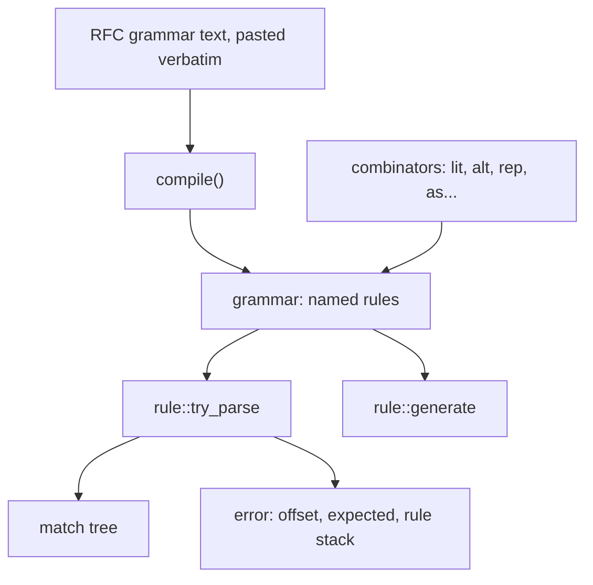

# ABNF

The layer the RFCs are written in. An RFC's own grammar is pasted into a
header and read as it stands, rather than approximated with `find()` and
`substr()` — and this is the machine that makes that possible.

A map. Every type named here is documented at its declaration, and where the
two disagree the header is right.

- `jlib/util/abnf.hh` — grammars, rules, matches
- `jlib/util/rfc3986.hh`, `rfc9110.hh`, `rfc2047.hh` — grammar text
- `jlib/net/rfc3501.hh`, `rfc5322.hh` — more of it
- 22 files across `net/`, `util/` and `ai/` parse with it

## Two public layers, and why the lower one cannot be hidden



The text front end is the point of the exercise:

```cpp
grammar g = abnf::compile(
    "addr-spec  = local-part \"@\" domain\r\n"
    "local-part = 1*atext\r\n"
    "domain     = 1*atext *(\".\" 1*atext)\r\n"
    "atext      = ALPHA / DIGIT / \"+\" / \"-\" / \"_\"\r\n");
```

**But the combinators stay public, because ABNF cannot express everything the
RFCs need.** RFC 3501 says:

    literal = "{" number "}" CRLF *CHAR8
            ; Number represents the number of CHAR8s

The actual constraint — that the octet count comes from the number just
parsed — is in a **comment**, because ABNF has no way to write it. `counted()`
is that constraint, in combinators, and it is why the lower layer cannot be
an implementation detail of the upper one.

`backref()` is the same shape for a value that must repeat, and `where()` for
a predicate that is simply code. Each is a place an RFC stopped being a
grammar.

## It is a PEG wearing ABNF's notation

Two departures from RFC 5234, both deliberate, both tested, both stated at the
declaration rather than discovered.

**Alternation is ordered choice.** The first branch that matches wins and the
others are not tried. RFC 5234's `/` is unordered, and the difference is
observable — in RFC 5234's *own* grammar:

    repeat = 1*DIGIT / (*DIGIT "*" *DIGIT)

Against `3*5` the first alternative takes the `3`, the enclosing rule then
wants end of input and does not get it, and the choice has already committed.
Written longest-first it parses. `tests/util_abnf_test.cc` asserts both.

**Repetition is possessive.** `*a` matches as much as it can and never gives
any back, so `*CHAR "@"` does not parse `a@b` — the repetition eats the `@`
and the concatenation has nothing left. `until()`, `counted()` and
`backref()` are the ways round it.

The consequence is real and measured rather than assumed: of the productions
in the compiled HTTP grammar, **eight have strings in their language that the
engine cannot read** — `chunk`, `chunked-body`,
`Accept`, `Vary`, `media-range`, `Range`, `range-set`, `ranges-specifier`
(#359). None is parsed with at runtime. How that was found is below.

**C++ precedence happens to be exactly right.** `>>` binds tighter than `|`,
so `a >> b | c >> d` groups as `(a >> b) | (c >> d)` — which is what RFC 5234
3.10 says concatenation against alternation means. No parentheses needed, and
none should be added for fear of it.

## Reading grammar text that came out of an RFC

`compile_options` exists because pasted text is messy in predictable ways:

- **`dedent`** strips the common leading indent, because the grammar in an
  RFC is indented.
- **`allow_bare_lf`** accepts LF where RFC 5234 says CRLF. Text pasted from a
  browser has bare LFs, and refusing it would defeat the entire purpose.
- **`seed_core_rules`** predefines Appendix B — `ALPHA`, `DIGIT`, `CRLF` —
  while letting a grammar redefine one, because RFC 3501 defines its own
  `CHAR8` and grammars do reach for a core name meaning something slightly
  different.
- **`prose`** is the seam. A `<described in words>` production compiles with
  no body and fails at *parse* time, with a position naming which prose rule
  was reached. Refusing to compile a two-hundred-rule grammar because one
  obsolete production is prose would defeat the purpose; failing when it is
  actually reached does not. Supplying an implementation is how the RFC's own
  words get written in combinators.

## What it refuses before it parses anything

`grammar::check()` runs three checks, and the first parse calls it:

- **undefined rules** — referenced and never defined
- **left recursion** — which would not terminate
- **repetition of something that can match empty** — which would loop forever

A grammar that passes those can be parsed against from several threads at
once: it is read-only once built, and every piece of parse state lives on a
per-call context. That is intentional and is why no memo table has been added
— a packrat cache on the grammar would end it, and on the context it would
not.

## When a parse fails, it says where

`try_parse` returns rather than throws, and the failure carries more than a
message: `offset()`, `line()`, `column()`, `context_line()`, `expected()` —
the terminals that could have continued — and `rule_stack()`, the named rules
open at the furthest failure.

That last one is more useful than it looks and also less: for

    GET /index.php?s=index/\think\app/... HTTP/1.1

the stack reads `request-line request-target origin-form query pchar`, which
locates the failure inside the target. But an SMTP greeting arriving on port
80 produces `request-line request-target absolute-form absolute-URI scheme`
— *also* inside the target, because `220` is a valid method token. The stack
locates a failure; it does not classify one (#343).

## Generating, and the property that checks the engine against itself

`rule::generate()` draws a string the rule can match: at an alternation pick a
branch, at a repetition pick a count, at a terminal emit bytes — the same tree
`parse` walks, run backwards.

**The round trip is the point**: anything `generate()` returns, `try_parse()`
on the same rule must accept in full. `tests/util_http_test.cc` runs 56,400
draws over 190 productions — the HTTP grammar's 194 rules less the four that
depend on prose — and that is how the eight divergences above were found — not by reading, which had not found them in months.

Termination is decided rather than hoped for. Before any drawing, a
fixed-point solves the shortest string every named rule can produce; at an
alternation that has gone deep enough, the branch with the smallest value is
by construction the one that reaches a terminal soonest. A rule whose value
never leaves infinity cannot be drawn from at all, which is the honest answer
for `From = mailbox` where `mailbox` is prose.

Four of the twelve node kinds cannot be run backwards — a predicate is an
arbitrary function, a back-reference must reproduce an earlier capture, a
counted length is IMAP's `{5}\r\n`, `until` scans for a terminator — and they
throw `generate_error` naming the node.

**The draw is identical on every platform**, which took a fix: the standard
specifies `mt19937_64`'s output sequence and says nothing about how a
distribution maps it onto a range, so libc++ and libstdc++ drew different
strings from the same seed. Taking the modulo off the engine directly makes a
seed mean the same thing everywhere, which is what makes a reported failure
reproducible.

## Who parses with it

    net/    address, rfc5322, rfc3501, imap_response, http_server
    util/   URL, http, Date, content_type, encoded_word, xml, conf, jinja
    ai/     pretokenizer

Three separate grammars are compiled from text: HTTP (RFC 3986 + 9110 + 9112,
194 rules), the jhttpd config language, and jinja templates. The rule names
are not interchangeable between them — asking the HTTP grammar for `config`
throws, which is a mistake made twice while writing the fuzz targets.

## What it is not

Not a parser generator: there is no code generation step and no build-time
tool. A grammar is data, compiled at first use.

Not RFC 5234 semantics, per above.

No memoization, so no packrat guarantee. Whether it is needed is a
measurement nobody has taken against a real grammar.

No error recovery: a parse fails at the furthest point reached and stops.
