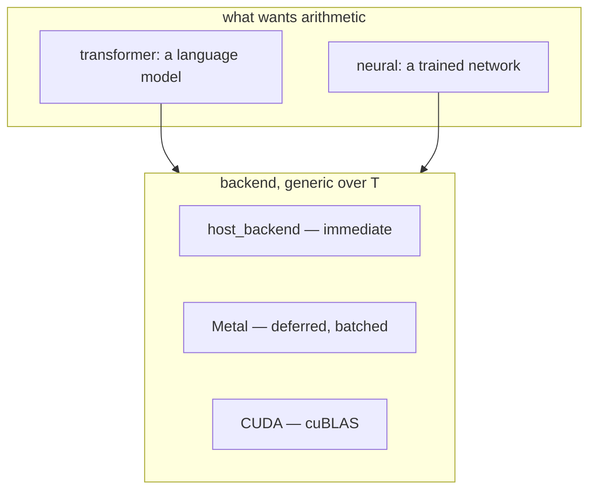
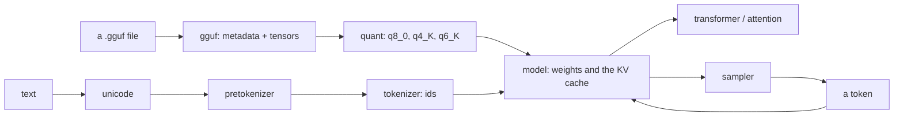

# The AI code

Two things share `jlib/ai/`, and they are not layers of each other: a
transformer that runs quantized language models, and a small neural network
that trains from scratch. They meet at one place — `backend`, which owns the
arithmetic — and nowhere else.

This is a map. Every type named here is documented at its declaration, and
where the two disagree the header is right.

- `jlib/ai/backend.hh` — tensors and operations, host or GPU
- `jlib/ai/gguf.hh`, `quant.hh`, `model.hh`, `transformer.hh`, `attention.hh`
- `jlib/ai/unicode.hh`, `pretokenizer.hh`, `tokenizer.hh`
- `jlib/ai/sampler.hh`, `chat.hh`, `generate.hh`, `engine.hh`
- `jlib/ai/neural.hh` — the from-scratch network
- `jlib/ai/openai.hh` — talking to somebody else's model
- `docs/jserve.md` — the servers built on this

## The device is a parameter, not a copy of the code

**This is the whole reason `backend` exists**, and the argument is written
from a scar. `jlib/cuda/neural.hh` was a 399-line copy of the network with
its multiplies routed through cuBLAS, and it carried three bugs that had
since been fixed in the original — fan-out initialisation, backpropagation
through already-updated weights, and a gradient that was not a mean. Nobody
noticed, because it does not build without CUDA. A second fork for Metal
would have made a third copy and a second wrong one.

So the step exists once and the device is a parameter. A backend supplies
opaque tensors and the operations a step performs; nothing above it knows
whether the numbers are in host memory or on a GPU.

**The contract that is easy to get wrong: operations may be deferred.** A GPU
backend batches them into one submission, because synchronising per operation
is what made the first Metal wiring slow — measured at up to 7.9×. A tensor's
contents are undefined until `wait()` returns. The host backend runs
everything immediately and its `wait()` does nothing, so **code that forgets
to wait works on the CPU and fails on a GPU**. Write the wait.

## Running a language model

**gguf** is the file: metadata and a tensor table over an `ifstream`. The
smallest model worth testing against is over a gigabyte, so `read()` seeks to
one tensor and dequantises it rather than loading the file — which makes
`read()` the expensive call and the one to count.

**quant** is how a tensor is stored. `q8_0` is 34 bytes per 32 weights, `q4_K`
144 per 256, `q6_K` 210 per 256 — each a block of quantized values with a
scale, dequantized on the way into the arithmetic. This is why a 7B model fits
in a laptop's memory at all.

**model** holds the weights and, crucially, the state — see below.

**The tokenizer is three stages, and the first two are the ones that go
wrong.** `unicode` supplies the character properties — its three tables are
regenerated by `unicode.py` while the surrounding code stays hand-written —
`pretokenizer` splits text into the pieces
the model's vocabulary was built over, and `tokenizer` maps those to ids. A
pretokenizer that splits differently from the one used at training produces
ids the model has never seen, and the output is fluent and wrong rather than
broken — the characteristic failure of this whole area.

**sampler** turns a distribution into a token: temperature, then top-k, then
top-p, and the order matters — the header says so because getting it wrong
changes the distribution rather than failing.

**chat** applies the model's own prompt template, because a chat model is a
completion model with a format it was trained to expect, and the format is
metadata in the file rather than a convention.

## A model instance is a conversation, not a compute engine

The most important thing in this directory, and the least obvious.

`model<T>` is **not** stateless. The key-value cache lives in it — per-block
`m_kc`, `m_vc`, `m_cache_len`, plus `m_seq` and the activation scratch — and
**that cache is the conversation**. Two requests running through one instance
would interleave their keys and produce fluent nonsense, silently.

So a loaded model is a **serialisation point**, not a worker pool. `engine`'s
`acquire()` hands out one session at a time and the rest wait. Two different
models run concurrently; two conversations against the same model do not.
Making them concurrent means separating the weights — read-only after
`load()` — from the cache and scratch, so that N conversations share one copy
of a 2.8 GB tensor set. That is a real refactor of `model` and `block`, and the
constraint is written up at #199.

**The cache is reset when a session is taken, not when it is returned.**
Returning it would suffice if every holder exited cleanly; a request that
dies mid-generation does not, and the next conversation would inherit its
keys — again silently. Resetting on acquire does not depend on the previous
holder having behaved, and it costs nothing: a length set to zero, no memory
freed.

What it forecloses is reusing a cached prefix between requests, which nothing
here does — an OpenAI-shaped request carries the whole conversation every time
and is re-prefilled from the start regardless.

## The from-scratch network

`neural.hh` is a dense feed-forward network with backpropagation, trained on
MNIST, sharing `backend` with everything above and nothing else. It exists
because writing one is the only way to be sure you know what the other half
is doing.

It has an unexplained wall. Five hidden layers train; six do not. Three fixes
moved earlier walls — fan-in initialisation, an activation that travels with
its derivative, and a gradient that is genuinely a mean — and **none of them
explains this one** (#245). That is written down rather than rounded off,
because an unexplained boundary is more useful stated than tidied away.

## Talking to somebody else's model

`openai.hh` is a client for the OpenAI-shaped API — the same shape jserve
serves, which is what lets jcode point at either a local model or a hosted
one without knowing which. It includes the event-stream reader for streamed
completions, which has to reassemble server-sent events across block
boundaries because a block is not a message.

## What this is not

No training for the transformer — the language model runs, it does not learn.
No LoRA, no fine-tuning, no quantization *of* a model (only reading quantized
ones).

No model eviction: `engine` loads on first use and never unloads, so a server
advertises more than it can hold (#278).

No batching across conversations, per the serialisation point above (#199).
