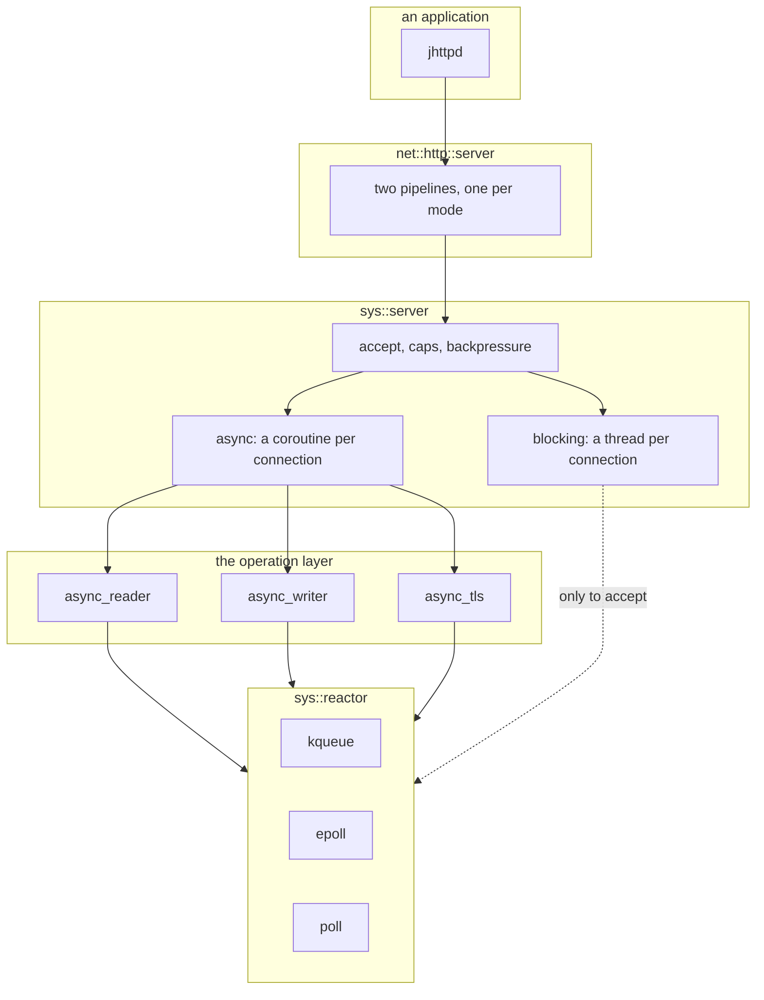

# The asynchronous layer

How a connection is waited for, read, and served without a thread each — and
why each layer stops where it does.

This is a map. Every type named here is documented at its declaration, and
where the two disagree the header is right; what this adds is the shape you
cannot get by reading any one of them.

- `jlib/sys/reactor.hh` — readiness
- `jlib/sys/task.hh`, `await.hh` — the coroutine type
- `jlib/sys/async_reader.hh`, `async_writer.hh`, `async_tls.hh` — operations
- `jlib/sys/server.hh` — accepting, and the two ways to serve
- `jlib/net/http_server.hh` — HTTP over both

## Why there is one at all

Everything in jlib that talks to the outside world is a `std::streambuf`: a
socket, a TLS connection, a subprocess, a serial port. That composes
beautifully and blocks completely. `ASServent` says so in as many words — its
responses travel down a pipe rather than a queue purely so that somebody
else's event loop can select on the read end.

Nothing in the library was that event loop. A program could wait for a request
or wait for a socket, and not both. The reactor is that loop, written down.

## The layers



Each layer adds exactly one thing, and the boundaries are where the arguments
live.

### `reactor` — readiness, and deliberately nothing else

It reports that a descriptor is ready and calls a function. What that function
does with the descriptor is the caller's business, and is always an ordinary
blocking-style call on a descriptor already known to be ready.

**There is no `async_read`, no completion handler, no buffer, no `error_code`,
no executor.** That restraint is the design rather than an omission. A
readiness loop serves a stackful fiber and a C++20 stackless coroutine
identically — both resume the same way — so a reactor that only says "ready,
here is your function" does not choose between them on the library's behalf.
The fork is not about readiness; it is about operations and completions, which
is the layer above.

`once()` is the resumption primitive, and the whole of what an awaitable
needs:

```cpp
void await_suspend(std::coroutine_handle<> h) {
    m_r.once(m_fd, reactor::READ,
             [h](reactor::token, int, reactor::event_type) { h.resume(); });
}
```

**Level-triggered, and that is a contract.** A registration stays ready for as
long as the descriptor is, so a callback that reads half of what is waiting
will be called again. That is what lets `basic_socketbuf::underflow` — which
reads once into a fixed buffer and cannot accumulate across calls — sit on top
unchanged. Neither backend uses `EPOLLET` or `EV_CLEAR`, and neither should:
edge triggering obliges every callback to drain to `EAGAIN`, which is an
operation layer, which is the thing deliberately absent here.

Three backends, chosen at build time with a runtime override for testing:
kqueue on the BSDs and macOS, epoll on Linux, and poll as the portable
fallback — kept working precisely so it does not rot on a machine that has
something better.

Beyond readiness it offers timers (`after`, `every`), cross-thread work
(`post`, `wake`), and a `work` guard that keeps `run()` from returning while
something still intends to use the loop.

### `task<T>` — a coroutine that produces a T, once

The return type of anything that suspends. Nothing exotic; it exists so the
layers above can be written as straight-line code.

### The operation layer — `async_reader`, `async_writer`, `async_tls`

What the reactor declines to provide, provided once, for the cases the library
actually has.

`async_reader` is the interesting one, and its shape answers the obvious
objection to per-octet parsing. **`get()` is synchronous and `fill()` is the
only coroutine.** `get()` hands back one octet from the buffer and says so
when the buffer is dry; `fill()` is awaited to top it up. So a framing
function that reads a header a byte at a time is *one* coroutine frame that
suspends only when the buffer empties — not one frame per octet.

`async_tls` puts the same interface over OpenSSL, whose `SSL_read` may want
either readiness direction regardless of which operation was asked for; that
translation is the whole of its job.

### `sys::server` — accepting, and the two ways to serve

One class, and which mode it is in depends only on which handler it was given.

| | blocking | async |
|---|---|---|
| handler | `void(socketstream&, const peer&)` | `task<void>(connection&, const peer&)` |
| a connection costs | a thread (or the accept thread) | a coroutine frame |
| the handler sees | a `std::iostream` | awaitable reads and writes |
| `threads` means | handler threads, 0 = serve inline | the size of the pool for offloaded work |

**The blocking mode is not deprecated**, and is the right thing for a handler
that wants a `std::iostream` — which is most of the library. What the async
mode buys is that a connection costs a frame rather than a thread, and that
ten thousand idle connections are ten thousand suspended frames rather than
ten thousand stacks.

Both modes share everything that decides *whether* to serve at all: the listen
backlog, the read timeout, `max_connections`, `max_per_address`, and the
backpressure that disarms the listeners when the server is full. Those are
about the peer rather than the mode, and an attacker must not get a different
answer by choosing one.

### `net::http::server` — two pipelines, and why that is not a mistake

HTTP is implemented twice over those modes: once as blocking code over
`socketstream`, once as a coroutine over `async_reader`/`async_writer`.

That duplication is a real cost and is paid deliberately. The alternative —
one pipeline templated over both — makes every decision in it depend on a
transport parameter, and the decisions are the part that must not differ. What
keeps the two honest is a parity test that drives the same requests through
both and compares the answers, rather than a promise that they match.

Anything that decides *what is wrong* — framing, a refused target, a status
code — lives in `util::http` and is called by both. Only the loops differ,
because one blocks and one suspends.

## A request, end to end

```mermaid
sequenceDiagram
    participant C as client
    participant R as reactor
    participant S as sys::server
    participant H as http::server
    participant A as application

    C->>R: connect
    R->>S: listener readable
    S->>S: accept; caps and per-address checks
    Note over S: full? disarm listeners until a slot frees
    S->>H: a coroutine per connection
    H->>R: await the head
    R-->>H: readable
    H->>H: parse_request_head, path_of, authority_of
    Note over H: malformed → 400, and no route is looked up
    H->>H: within_rate → allowed_through
    H->>A: route handler
    A-->>H: response
    H->>C: write
    Note over H: keep-alive → await the next head on the same frame
```

The order is not arbitrary and is asserted by tests. The rate limiter runs
**before** authentication, so a flood meets the cheap defence first and a 429
is reachable without credentials. The target is turned into a path **before**
any route is consulted, so a malformed one is refused without touching the
routing table.

## What bit, and where the scars are

Read these at the site before changing the code near them.

- **A handler blocking the reactor thread.** In async mode the handler *is*
  the loop; a synchronous Argon2 verification or a `std::sort` under a lock
  stops every other connection. Work that blocks goes to the pool, and the hop
  is visible in the code for that reason.
- **Accept under EMFILE.** Running out of descriptors used to sleep on the
  reactor thread. It now disarms the listeners and re-arms from a timer — and
  the timer is armed *before* the flag is set, because an exception between
  the two would otherwise leave the listeners off for good.
- **Level-triggered means a callback that reads nothing spins.** The contract
  above cuts both ways.
- **Two pipelines drift.** They have, and the parity test is why it was
  noticed.

## What this layer is not

There is no scheduler, no work stealing, no executor abstraction, and no
cancellation beyond `sys::cancelled` propagating out of an awaited operation.
There is one reactor per `sys::server`, and a program wanting several runs
several.

Multiple threads may `post()` into a reactor, and exactly one may `run()` it.
