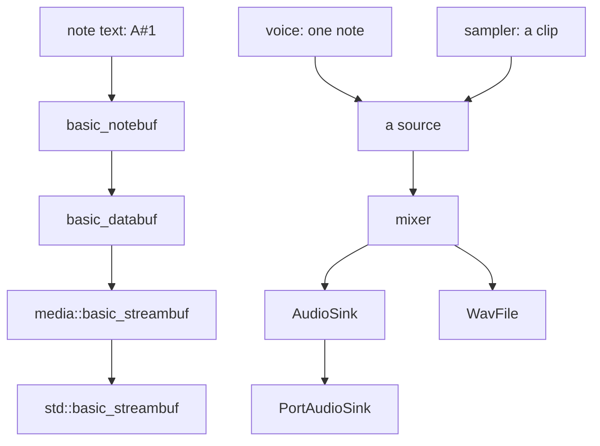

# Audio

Synthesis, sampling, mixing and playback — and, because this is jlib, a
`std::streambuf` you write `A#1` into and get sound out of.

A map. Every type named here is documented at its declaration, and where the
two disagree the header is right.

- `jlib/media/stream.hh`, `datastream.hh`, `notestream.hh` — the stream chain
- `jlib/media/voice.hh`, `wavetable.hh`, `instrument.hh`, `sampler.hh`
- `jlib/media/mixer.hh`, `Dsp.hh`, `AudioSink.hh`, `PortAudioSink.hh`
- `jlib/media/WavFile.hh`, `wavstream.hh`, `PlayList.hh`, `Player.hh`

## Two layers, and they meet at "a source"

The upper path is the library's oldest habit — everything is a stream — and
the lower is a synthesiser. They are genuinely separate designs that meet at
one idea: **a source produces frames, and nothing downstream asks what kind
it is.** A recording and a synthesised note are both sources, so a mixer does
not know which it has. That is the whole of what makes samples and
instruments mixable.

## The waveforms are built by adding sine waves

The most consequential decision here, and the reason it sounds right.

The obvious sawtooth is a ramp and the obvious square is `sign(sin)`. **Both
alias badly.** A ramp has energy at every harmonic without limit, and
everything above half the sample rate cannot be represented — it folds back
down as an inharmonic tone with no relation to the note. Quiet at the bottom
of the keyboard, unmistakable at the top, and **no filtering afterwards
removes it**, because by then the aliases are indistinguishable from signal.

Adding harmonics up to Nyquist and stopping cannot alias, because nothing
above Nyquist is ever generated. It costs a `sin()` per harmonic per sample,
which is why no real-time synthesiser does it — but a note here is rendered
ahead of being played, so the cost is paid once and never felt.

And the harmonic count is a brightness control for free: ask for four and the
saw is dull, ask for everything and it is bright.

## Which is too slow to do live, so: wavetables

Summing harmonics is exact and far too slow for many voices. Measured:

| | cost |
|---|---|
| 64 voices at 110 Hz, summed directly | **122% of a core** |
| 1,024 voices from a table | **1.2% of a core** |
| 16,384 voices from a table | 12.5% |

About a thousand times cheaper, and it matters because a D=10 hypercube has
1,024 vertices and `jhypermusic` gives each one a voice.

It is the same sum, so the band limiting is identical. What a table adds is
two approximations, both measured, both chosen to be small:

- **Interpolation.** Reading between entries is not exact: a 4,096-entry
  table read cubically is **117 dB down** — below the noise floor of 16-bit
  audio, at 16K per table.
- **Banding.** One table has one harmonic count, so it serves a pitch range
  by being band-limited for the top of it, and a note at the bottom is duller
  than it could be. At one table per octave that is **19–34 dB down, all in
  the top octave**, which reads as slightly less air rather than as anything
  wrong.

**Neither is aliasing, and that is the point.** Aliasing puts energy at
frequencies unrelated to the note and is wrong at any level; these either sit
on real harmonics or take a little off the top of them.

## The mixer is three things that are deliberately not one thing

- **Per-child gain** is the fader: always available, never automatic, never
  overridden. Balancing a mix is an artistic decision.
- **Automatic staging** is a default for when nobody is riding faders —
  `jhypermusic` generates a voice per vertex from geometry and there is no
  engineer. **Off unless asked for**, because a gain that moves when you add
  a track is hostile to somebody who has just set a level by ear.
- **The limiter** is a safety net, not a mixing policy. It catches peaks that
  get through; it does not decide the balance.

And it reports: `peak()`, `rms()` and `reduction()` exist so a meter can be
built on it. That is the difference between a tool and a black box — a
limiter working hard means the gain staging is wrong, and that is only
actionable if it can be seen.

## Notes as a stream

`basic_notebuf` extends `basic_databuf` extends `media::basic_streambuf`
extends `std::basic_streambuf`. So a note string — `A#1` — written into a
stream comes out as audio, and everything in the library that takes an
`istream` composes with it.

`instrument` is what a note *sounds* like, held separately from which note it
is: pitch and duration belong to the note, timbre to the instrument, set up
once and used by many. A note string can override any of it for itself.

## The output contract

`AudioSink` is the interface an output device satisfies, and it exists
because `Dsp` grew organically against OSS `/dev/dsp`. Restating it changed
two things, both worth knowing:

- **Buffering is counted in frames, not bytes.** A frame is one sample across
  every channel. Dsp's fragments were a byte count with no relation to frame
  size, so a fragment boundary could fall in the middle of one.
- A backend other than `/dev/dsp` can satisfy it — which is `PortAudioSink`,
  and why this builds on a machine that has never heard of OSS.

## Where it meets the rest of the library

`jhypermusic` is the crossover: geometry from the 4-D code becomes voices —
one per vertex — and the mixer's automatic staging exists for it, because a
1,024-vertex hypercube has no engineer riding 1,024 faders.

## Two generations of code in one directory

Worth knowing before reading. The synthesis side — `voice`, `wavetable`,
`mixer`, `instrument`, `sampler` — is recent and carries its reasoning and
its measurements at the declaration. The stream plumbing — `stream.hh`,
`notestream.hh`, `datastream.hh` — is much older, predates the documentation
habit, and is commented at around 11–18% against the synthesis side's 37–47%.

The older code is not worse; it is undocumented, which is a different thing
and a larger risk. Where this document is thin, that is why.

## What it is not

No MIDI in or out. No plugin format, no VST. No effects beyond the limiter —
no reverb, no delay line as an effect (`delayed.hh` schedules a source, it
does not echo one).

No real-time synthesis guarantee: notes are rendered ahead, which is what
makes the harmonic sum affordable, and a design that wanted live keyboard
response would need the wavetable path throughout and a hard latency budget
neither layer currently states.
