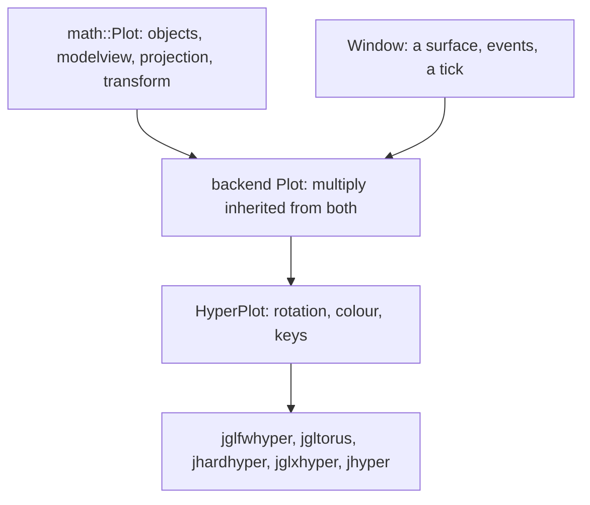

# Graphics

Three backends, one plot, and a projection that turns N dimensions into
something a screen will take. The interesting work happens before OpenGL sees
anything: by the time a vertex reaches `glVertex`, the hard part — collapsing
a 16-cube to three dimensions, once per vertex per frame — is already done.

A map. Every type named here is documented at its declaration, and where the
two disagree the header is right.

- `jlib/math/Plot.hh` — the reduction itself; see [math.md](math.md)
- `jlib/x` — X11 drawing primitives, no OpenGL
- `jlib/glx` — OpenGL on X11
- `jlib/glfw` — OpenGL, portable; the backend that is current
- `jlib/gl`, `jlib/glu` — shared helpers: includes, buffers, lights, shapes
- `jlib/apps/Hyper.hh` — the hyper app body, shared across backends
- `jlib/metal/compute.hh`, `hyper_reduce.hh` — the reduction on the GPU

## A plot is a window and a plot



All three backends spell it the same way:

```cpp
class Plot : public math::Plot<T>, public Window
```

and `HyperPlot<T, Plot>` is a mixin parameterised on whichever one, so the
rotation, the colour scheme and the key bindings are written once and the
backend is a template argument. That is why `jglxhyper` and `jglfwhyper` are
the same program against different windowing stacks.

## Three backends, and a fourth that is gone

| module | surface | dimensions it draws |
| --- | --- | --- |
| `jlib/x` | Xlib: `XDrawPoint`, `XDrawLine`, … | 2-D only, no OpenGL |
| `jlib/glx` | OpenGL on an X11 context | 3-D |
| `jlib/glfw` | OpenGL on a GLFW window | 3-D |

`jlib/glut` was the original and is **not in `SUBDIRS`** — the directory now
holds a single stale `Makefile.in` and nothing else. The comment in
`jlib/gl/opengl.hh` still refers the reader to `jlib/glut/main.cc`, which no
longer exists.

GLUT's departure left a mark worth knowing about: it emitted `init_buffers`
and `init_lights` *before* the plot's constructor had connected to them, so
`GL_DEPTH_TEST` was never once enabled in any hyper app. The GLFW backend
sets its GL state directly in the constructor rather than through a signal,
which is what closed that hole — but the depth test is still off, because by
then the figures were being drawn, framed and blended on the assumption that
it would be. **Draw order is occlusion in these apps.**

## Fixed-function, on purpose

`jlib/gl/opengl.hh` routes every GL include and pins the profile. Apple
deprecated OpenGL in 10.14 and ships the headers under different paths from
everyone else; the rendering here is fixed-function 1.1/1.2 and wants the
legacy 2.1 context Apple still provides. **Never request a 3.2+ core
profile** — there is no shader path to fall back to.

That constraint shapes everything downstream. The drawing optimisations below
are `glBegin` batching and client-state vertex arrays, not vertex buffer
objects and not shaders, because those are what a 2.1 context has.

## What the backends receive, and the wart in it

`math::Plot` reduces **N to 2** and hands pixel pairs down:

```cpp
virtual void draw_point(std::pair<uint,uint> p, uint index) = 0;
```

That suits `jlib/x`, which has only pixels to draw with. It does not suit a
GL backend, which could take real 3-D and let the hardware do the last step —
and `jhardhyper` does exactly that, reducing **N to 3** and handing
`glVertex4dv` a vertex. To get there it declares its own `emit_point`,
`emit_line` and `emit_face` taking `math::vertex<T>` — none of which override
anything, since the base's are a different signature — and it does not
include `Hyper.hh` at all. It carries its own `HyperPlot`, and the three
mentions of the shared header in that file are comments explaining why.

Two open issues, and they are the same issue from both ends: #24 (backends
should take 3-D vertices, not pixel pairs) and #28 (delete jhardhyper's fork).
Worth reading before changing either.

## The tick

`glfw::Window::iterate` is one frame: poll events, deliver the synthetic
first configure, emit `timeout`, then **wait out what is left of the tick**.

```cpp
const microseconds spent = duration_cast<microseconds>(steady_clock::now() - began);
const microseconds left  = microseconds(m_timeout) - spent;

if(left > microseconds::zero())
    glfwWaitEventsTimeout(duration<double>(left).count());
```

The remainder, not the whole. Sleeping the full interval *before* the work
made a frame cost `interval + work` rather than `max(interval, work)`, and
since vertex count doubles with each dimension, one step of D took the app
from comfortable to missing every other vblank — a cliff rather than a slope
(#377, #379).

`glfwWaitEventsTimeout` rather than a sleep, because this is the thread that
reads input: a sleep here makes a keystroke wait out the interval.

`m_timeout` defaults to 10,000 µs, so **throughput is capped at 100 fps**
regardless of the display. At low D the app sits against that ceiling and the
frame rate understates the headroom.

`JLIB_FPS=1` reports frames a second from `flush()`, which is where buffers
swap and therefore the only place that knows a frame reached the screen —
an `iterate()` can wake for a keystroke and draw nothing.

## The reduction on the GPU

`metal::compute` compiles MSL at runtime, allocates unified-memory buffers
and dispatches. `metal::hyper_reduce` is one fused kernel, one thread per
vertex, running the whole D-to-3 chain — compiled with D as a literal so the
per-thread scratch is exactly sized.

**Not a gemm, and the reason matters.** In perspective mode every step
divides, so the chain is not linear and does not compose into one matrix; a
gemm per step would be D-3 dispatches a frame against a ~300 µs dispatch
floor. In orthographic and mixed it *does* compose — see [math.md](math.md)
and #380.

MSL has no `double` and the apps are `GLdouble`, so this is float. Measured
divergence is 1–4e-7 relative, flat from D=4 to D=19: under a thousandth of a
pixel, and not compounding across thirteen chained divides.

Below about D=10 the GPU loses to the CPU — the dispatch floor is latency,
not arithmetic — so the CPU path remains and is chosen per D.

## What the frame actually cost

At D=16, hypercube, measured in the app:

| | wireframe | faces |
| --- | --- | --- |
| before | ~250 ms | 3202 ms |
| after | 11.5 ms | ~752 ms |

Two findings, in the order they were learned, both the same shape:

1. **One `glBegin`/`glEnd` per primitive** — ~131,000 pairs a frame at D=14,
   at roughly 245 ns each. Hoisting them around the loop: 3–8× (#383).
2. **Per-vertex immediate-mode calls** — ~229,000 `glVertex4dv` a frame.
   Client-state vertex arrays: another 1.5–2× (#386).

And a correction worth carrying: the GPU reduction measured 34× in isolation
and **1.58× on the frame**, because the reduction was 37% of it and the
drawing was the rest. An isolated benchmark cannot see its own denominator.

Faces were batched to 4.3× and then left alone (#385, closed): above D≈12
they stop carrying information, so the frames would not be watched.

## Measuring any of this honestly

Three things will mislead you, all learned the hard way:

- **A foregrounded window may be vsync-limited**, in which case every D reads
  60 fps and distinguishes nothing. Benchmark with the window backgrounded —
  and note that jhardhyper sustains 94 fps on a 60 Hz panel with vsync
  requested and honoured elsewhere, which is #384 and still unexplained.
- **The machine drifts in both directions.** Light sustained load ramps the
  clocks up (D=20 improved 207 → 165 ms over fifteen seconds); heavy load
  thermally throttles a fanless machine (D=14 with faces degraded 142 → 224
  ms over seven). Comparisons need matched thermal state.
- **Discard the first reading after any change.** The counter resets its
  window on a geometry rebuild, but the rebuild itself — new objects, new
  hues, new caches, a recompiled Metal kernel — lands in the frame that opens
  the next one.
