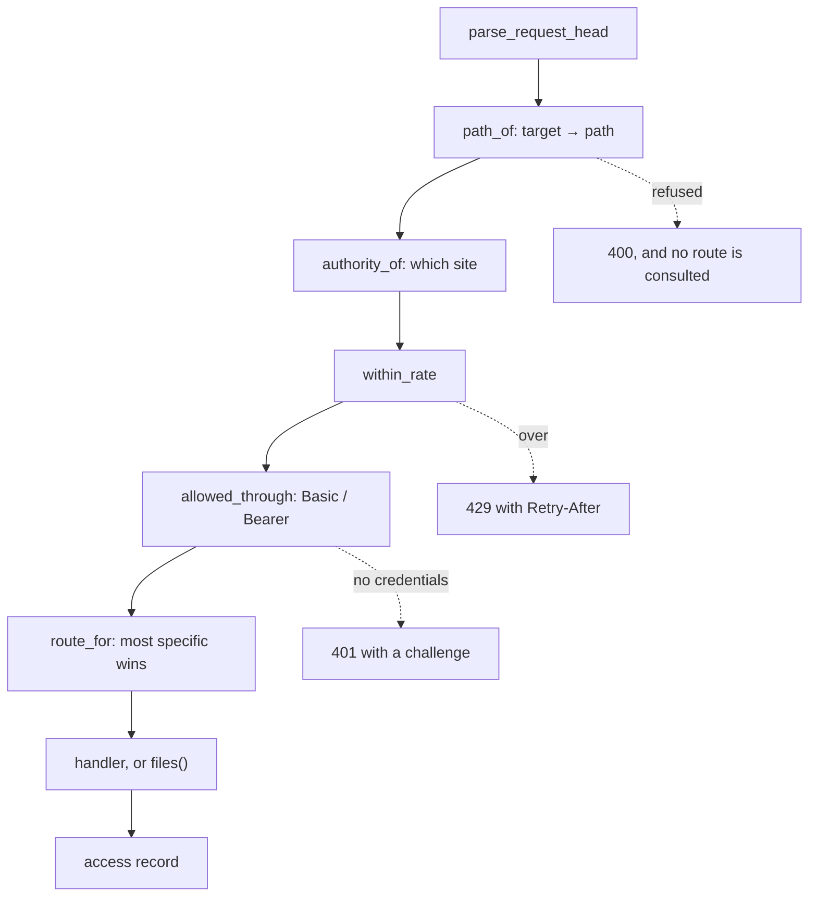

# The HTTP server, and jhttpd

Two things, and the boundary between them matters: `net::http::server` is a
library that serves HTTP over `sys::server`, and `jhttpd` is a daemon that
configures one from a file and runs it under an init system.

This is a map. Every type named here is documented at its declaration, and
where the two disagree the header is right.

- `jlib/net/http_server.hh` — routes, guards, sites, files, the limiter
- `jlib/apps/jhttpd.hh` — configuration, logging, the daemon
- `docs/async.md` — the reactor and the two modes this is built on

## What it grew into

It began as a test harness for the HTTP *client* and said so — "as narrow as
the client" — and that stopped being true one branch at a time. It now has
keep-alive (async only), chunked output, route patterns with most-specific
match, `HEAD` answered from the `GET` route, conditional requests, byte
ranges that seek rather than read, virtual hosts with SNI, Basic and Bearer
guards per prefix, and a per-address rate limiter.

**A buffered response is accumulated whole**, which is what lets a handler
that throws still be answered with a 500. Streaming gives that up knowingly;
`files()` keeps it regardless by deciding everything — 404, 304, 416 — before
a byte goes out.

## The shape of a request

`docs/async.md` has the transport sequence. What this layer adds, in order,
and the order is asserted by tests:

Two orderings are deliberate and worth not undoing:

**The limiter runs before authentication.** A flood meets the cheap defence
first, and a 429 is reachable without credentials — otherwise the rate limit
would protect only the thing already behind a password.

**The target becomes a path before any route is consulted.** A malformed
target is refused without touching the routing table, so nothing downstream
ever sees a string that failed to parse.

## How a request finds its site

By the authority it named — the absolute-form target's, or `Host` — compared
**exactly** after normalisation: lowercased, port removed, one trailing dot
removed. No wildcards: `*.example.com` is a second way to pick the wrong
site, and the safe version needs rules about label counts and which pattern
wins. Exact names first; patterns can come with a test that says what they
mean.

**A name nothing claims gets the default site**, and the direction is the
point: the fallback is chosen by the server's configuration, never by the
request. A client cannot name its way into a site that was not registered for
it — the worst it can do is fail to name one and land on the default, which is
what a one-site server has always done.

That is also a posture decision worth making on purpose. Any domain pointed
at the address gets the default site's content served under its name. On
dancingdragon, `lordbacchus.com` resolves there, has no `site` block, and is
answered with dancingdragon's pages — as it was under Apache. Fine, until it
is not; a default that refuses unknown names is a one-block change.

Unlike nginx this is per *request*, not per container: a path with no
site-qualified route still reaches an unqualified one, so one `site()` call
does not hide the rest of the table from that name.

## Serving a file, and why it is three checks

`files()` is where a string from a stranger becomes a path on disk, so it is
the most carefully written thing here. The order in `locate()`:

1. **Open first**, and bind every later answer to what was opened. This used
   to be realpath, then stat, then open by name — three lookups of a name that
   can mean something different each time.
2. **Regular files only**, from the descriptor rather than the name.
   `O_NONBLOCK` because opening before knowing the type would otherwise block
   on a FIFO inside the root.
3. **Contained**, by `realpath` against the root *and* by comparing the
   resolved name's device and inode against the descriptor's — so a symlink
   that pointed outside when opened and back inside before the check cannot
   pass.

A hard link inside the root to a file outside it still passes, and that is not
a regression: no check made from a path can say otherwise, because the inode
genuinely is inside the root by every name the filesystem has for it.

## What gets refused, and what that looks like in practice

The refusals are not hypothetical. A day of dancingdragon's log — 8,394
requests, 23 hours, of which about 6% is human — contains:

| refusal | count | what sent it |
|---|---|---|
| an encoded path separator | 73 | `%2e%2e%2f` chains hunting `.env` and `/proc/self/environ` |
| a control character | 33 | `%00` truncation probes: `/%00credentials.xml`, `/%00.env.server` |
| no Host | 2 | HTTP/1.1 without one |
| not a request line | 4 | SIP and RTSP scanners: `OPTIONS sip:nm SIP/2.0` |

**The `%00` probes are the attack the NUL check exists for.** Everything above
`path_of` works on `std::string`, which holds a NUL happily; every filesystem
call below takes `c_str()`, which stops at one. So `/static/page.html%00.jpg`
was one name to the router — which matched a route, chose a guard, and picked
a content type — and a shorter one to `open()`. Measured before the fix: 200,
carrying the wrong file.

The rule is every control character rather than NUL specifically, and the
scanner above is the argument for that width: it iterated about forty `.env`
spellings with cache-busting query strings, and a NUL-only check is the kind
a wordlist walks around.

## Rate limiting, as it behaves on a real port

A token bucket per address: `request_rate` refills, `request_burst` is the
ceiling. What that means in practice, from one day's traffic against
`rate 50 / burst 100`:

| client | peak | sustained | outcome |
|---|---|---|---|
| a scanner at 153/s | 153/s | ~110/s | throttled, 301 responses |
| a scanner at 63/s | 63/s | ~45/s | **not** throttled |

The second made *more* requests in total. The burst allowance absorbing peaks
is the designed behaviour and is why an ordinary visitor pulling dozens of
assets does not trip it — a limit that breaks a real page load is worse than
no limit, because it looks like the site is broken.

**The address is the peer and nothing else.** No `X-Forwarded-For` is
believed, because a header a client writes is a limit a client can evade.
Behind a proxy that means every request appears to come from the proxy, and
the limiter must be configured there instead.

## The logs, and the field that is not safe

Access records are Combined with the site prefixed. Everything in a log line
came from a stranger, and a CR or LF in one forges entries — a log an attacker
can write is worse than none, because it is believed.

Most fields are safe because the grammar already refused what would break
them. **`access::user` is the exception**: it comes from decoded Basic
credentials, which are base64 and can carry anything. It is escaped, and the
test asserts the record carries the raw bytes *before* asserting the line does
not — so it fails if the escaping is removed rather than passing because the
bytes were dropped upstream.

## jhttpd, the daemon

The library above, plus everything an init system needs.

- **`--test`** parses the config, checks every root is a directory, and reports
  certificate expiry. It runs as `ExecStartPre`, so a bad config fails the
  unit rather than the site.
- **Privilege**: binds first, drops after. The unit deliberately has **no
  `User=`** — setting it at all, even to `root`, makes systemd take its
  change-identity path and strip `CAP_SETUID`, and the failure reads as
  `setuid() failed: Operation not permitted` with nothing pointing at the unit.
- **`Type=forking`** with a pidfile, because a `Type=simple` daemon that forks
  is a restart loop with a working website — systemd reaps the parent, the
  child keeps serving, and `--test` cannot see it (#334).
- **Reload** on SIGHUP re-reads the file into a *default* options object, so
  what comes back is what the file says rather than the file laid over what is
  running. A config with a typo leaves the server exactly as it was. The
  certificate is re-read, which incidentally rotates the TLS session ticket
  keys — see the note in `sys/tls.cc`.
- **Logs** reopen on SIGHUP for rotation, and recover on their own from a full
  disk: a failed stream is reopened rather than left with a sticky `badbit`
  silently discarding everything after.

## What it is still not

No HTTP/2 or /3. No compression (#233). No `multipart/byteranges`, so a
multi-range request gets the whole body (#232). No `If-Match` or
`If-Unmodified-Since`, so a precondition can only succeed and 412 is
unreachable (#231). No `Vary`. No Digest, no sessions, no login form, and
**no authorisation** — a verifier says whether credentials are good, never
what they may do.

`OPTIONS *` answers 400 rather than a server-wide `Allow` (#360). An over-cap
head or body answers 400 where RFC 9110 has 431 and 413 (#361).
