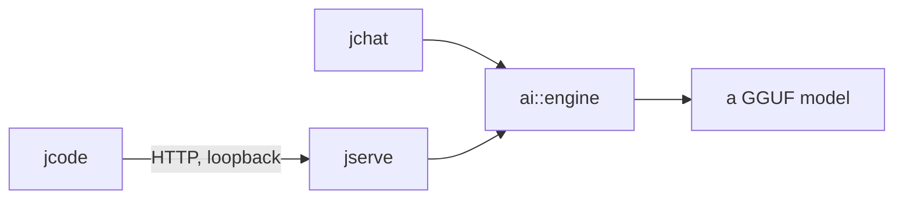

# jserve

An OpenAI-compatible endpoint over a local model, so that other programs can
use one without linking it.

This is a map. Every type named here is documented at its declaration, and
where the two disagree the header is right.

- `jlib/apps/jserve.hh` — the OpenAI-compatible endpoint
- `docs/ai.md` — the engine underneath
- `docs/jchat.md` — the terminal client
- `docs/jalpaca.md` — the same conversation with a transcript
- `docs/jcode.md` — the harness that talks to jserve
- `docs/jhttpd.md` — the HTTP server jserve is built on

jcode is the odd one: it does not link the engine at all. It speaks the
OpenAI wire format to jserve, which is what lets it point at a hosted model
instead without knowing the difference.

## The surface

`GET /v1/models` and `POST /v1/chat/completions`, over `net::http::server`,
answering the shape OpenAI clients expect — including `text/event-stream`
when `stream` is set.

**It is for loopback.** Nothing authenticates. An OpenAI-compatible endpoint
reachable from anywhere is an open invitation to spend somebody else's GPU,
and jcode takes the URL as a flag rather than defaulting to something it
could reach past the machine.

**The endpoint is templated on the engine**, and that is a testability
decision with a cost the header argues about. The only consumer of
`net::http::server` in the tree had no test in `make check`, because driving
it meant loading a GGUF and nothing in CI can download one. What was
uncovered was not the model — `ai::generate` has its own tests — but the
*glue*: an OpenAI request becoming turns, the trimming, the system turn
folded for a template that refuses one, the order of events in a stream, and
every refusal.

So a test supplies an engine whose session answers with a fixed sequence of
tokens. It is duck-typed rather than an interface **on purpose**: an abstract
base here would be a virtual call per token on the real path, paid forever
for a test.

**One conversation at a time per model**, which is not jserve's choice — see
`docs/ai.md`. The KV cache lives in the model instance and *is* the
conversation, so two requests against one model cannot overlap.

**Busy is an answer, not a wait** (#280). A blocking `acquire()` on the
reactor thread would stop every other connection, so jserve hops to a pool
thread for `prepare()` — which does the loading — comes back, and calls
`try_acquire()`, which never blocks and never loads. A model already in use
gets **503 with `Retry-After`**, and the header is careful that the value is
a floor rather than an estimate, because nobody can know how long the
conversation in front will take.

## What it is not

jserve does not authenticate, and does not unload a model once loaded
(#278). It does not batch across conversations: one model serves one
conversation at a time, and the rest are refused rather than queued (#368).

That is the one gap here with a number attached. Decode on Qwen2.5-Coder 7B
runs at 22 tok/s, which #196 measures at 83% of the device's bandwidth
ceiling — so a token is mostly the cost of reading the weights, and four
conversations sharing one pass would read them once for all four rather than
four times.

A client that hangs up during prefill is not noticed until the first token,
because `peer_gone()` is only asked in the per-token callback and prefill
produces none — so the server keeps working on a conversation nobody is
listening to and answers 503 to everyone else (#283).
