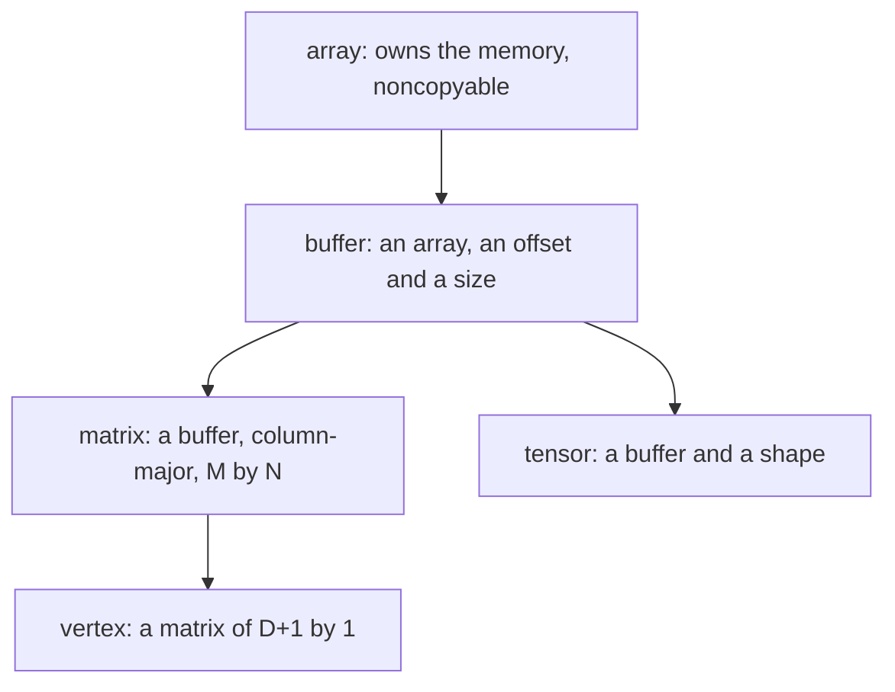

# Math

Arbitrary-dimension linear algebra, and the projection that makes a 16-cube
into something a screen can show. Unusually for a numeric core, this is also
where the graphics live: the same `matrix` that carries a model's weights
between the CPU and a GPU backend is the one that rotates a hypercube through
a plane you cannot point at.

A map. Every type named here is documented at its declaration, and where the
two disagree the header is right.

- `jlib/math/buffer.hh` — `array`, `buffer`: storage and slices of it
- `jlib/math/matrix.hh` — `matrix`, `vertex`, `object`, `plane`
- `jlib/math/tensor.hh` — `tensor`
- `jlib/math/polynomial.hh` — `Polynomial`
- `jlib/math/Plot.hh` — the N-to-2 reduction and the plot base
- `jlib/math/dump.hh` — per-vertex capture, for comparing two implementations
- header-only, all of it: `jlib/math` builds no library

## Storage: one allocation, many views



`array<T>` owns the memory. `buffer<T>` is a **slice** of one — an offset and
a length over a shared `array` — so `buffer(b, offset, size)` costs a
refcount rather than a copy. Everything above is built on that, which is why
slicing a tensor is free and why two tensors can quietly share storage.

**Column-major, on purpose.** The comment at `matrix::rep` says why: so the
data can be handed to GL without a transpose, and so a column vector is
simply an `M x 1` matrix rather than a special case. `vertex<T>` is exactly
that — which is how `glVertex4dv(v.data())` works at all.

**`array` zeroes with `memset`**, so `T` has to be something a zero fill
makes sense for. Every `T` in the tree is a float, a double, or a curve
scalar that is a byte array, so this has never bitten — but it is a real
constraint on the template, not a stylistic choice.

## matrix: the graphics transforms, past three dimensions

The static factories are the familiar set, each taking the dimension:

```cpp
static matrix<T> identity(uint n);
static matrix<T> project(uint n, const std::vector< std::pair<T,T> >& clip);
static matrix<T> translate(uint n, const vertex<T>& v);
static matrix<T> rotate(uint n, plane p, double rad);
static matrix<T> lookAt(uint n, const vertex<T>& eye, ...);
```

**`rotate` takes a plane, not an axis**, and that is the whole generalisation
in one signature. "Rotation about an axis" is a three-dimensional accident:
what a rotation actually fixes is a plane, and in 3-D the axis is just the
one direction left over. In 4-D there is no leftover direction, so `plane {i,
j}` names the two coordinates that turn into each other and every other
coordinate is untouched. A 4-cube has six such planes against a 3-cube's
three, and the three new ones are the ones that touch the fourth axis.
Turning in those is what makes the figure evert rather than merely spin: a
vertex moves along the axis being projected away, so the divide swaps which
cell is inside. jhardhyper rotates in all of them by default, and the note at
its `r = n` records what happened when it did not.

`project(n, clip)` returns an `(n+1)`-square matrix that drops one dimension,
with the clip volume giving the frustum for the axis being projected away.

### vertex, and the homogeneous coordinate

A `vertex<T>` of dimension `D` is a `(D+1) x 1` matrix: `D` spatial
components and a homogeneous one at index `D`, which the constructor sets to
1. Two operations do the work:

- `normalize()` divides **all** `D+1` components by `[D]` — the perspective
  divide, after which `[D]` is 1
- `change(n)` resizes to `n+1`, keeps the first `min(n, D)` components, and
  writes 1 into the new `[n]`

A reduction step is a multiply, then optionally a `normalize()`, then a
`change(d-1)` that drops the component just projected away. Those three lines
are the whole of it; everything else is bookkeeping.

## One operator, two conventions

The sharpest hazard in this module:

| expression | meaning |
| --- | --- |
| `matrix * matrix` | the matrix product |
| `tensor ^ tensor` | contraction — **the matrix product, at rank 2** |
| `tensor * tensor` | the **outer** product: rank `a+b`, shapes concatenated |

So `*` means one thing for `matrix` and a different thing for `tensor`, in
the same namespace, and both compile. A reader who assumes `tensor * tensor`
multiplies matrices gets a rank-4 object and no diagnostic.

The `^` choice is defensible on its own terms: contracting the last axis of
`a` against the first of `b` is what makes rank 2 `^` rank 2 the matrix
product, and rank 1 `^` rank 1 the dot product delivered as a scalar. It is
the pairing the rank-2 special case had already chosen, generalised. But it
does leave `*` free, and free is what it got used for.

## tensor: slices share, and const is shallow

`t[i]` slices the first axis and returns a view over the same storage. The
`const` overload returns a `const tensor`, so `t[i][j] = x` will not compile
on a const tensor — but the constness is **shallow**, as it is for any handle
type. Copy the result into a non-const `tensor` and you can write through it
to the same memory. Blocking that properly needs a distinct const view type,
which is #143.

## Polynomial: why the power is a policy

```cpp
template<typename T, typename P = Power<T>>
class Polynomial;
```

`Power` defaults to `std::pow` and looks like over-engineering until you find
the only non-test user:

```cpp
typedef math::Polynomial<curve::Scalar, curve::Scalar::Power> Polynomial;
```

`jlib/crypt/groth.cc`. The coefficients are scalars in a curve's field, where
`std::pow` is not merely inaccurate but meaningless — exponentiation there is
modular. The policy is what lets one polynomial implementation serve both a
plot and a zero-knowledge proof.

## Plot: the reduction

`math::Plot` reduces **N to 2** and hands pixel pairs to a backend —
`draw_point(std::pair<uint,uint>, uint)`. `map()` does the last step, scaling
by the largest projected radius seen so far so the figure fills the window.

jhardhyper's plot is the other arrangement: it reduces **N to 3** and gives
real 3-D to GL, which then does 3-to-2 in hardware. Both walk the same chain.

Which steps divide is the projection mode, and it is the thing worth
understanding:

| mode | divides at |
| --- | --- |
| `orthographic` | no step |
| `mixed` | the outermost step only |
| `perspective` | every step |

This is not a rendering preference, it decides whether the chain is linear.
With no divides every step is affine, so the whole chain **composes into a
single matrix** — `O(D²)` per vertex instead of `O(D³)`. `mixed` collapses to
one matrix plus one divide. `perspective` does not compose at all, and that
is why the GPU path for it is one fused kernel rather than a sequence of
matrix multiplies. See #380 for the collapse, unimplemented, and #376 for the
kernel.

`m_project` holds one projection matrix per step, built once a frame; `m_mvp`
holds `projection.top() * modelview.top()`. Both were once rebuilt per vertex
— at D=14 the setup cost more than the reduction it was setting up.

## dump: comparing two implementations honestly

```
JLIB_PLOT_DUMP         path to write to; unset means off
JLIB_PLOT_DUMP_SKIP    frames to pass over first (default 0)
JLIB_PLOT_DUMP_FRAMES  frames to capture once started (default 1)
```

`dump::vertex(tag, source, result)` records one line per vertex — what went
in and what came out. It exists because a reduction can be rewritten,
vectorised or moved to a GPU, and "it still looks right" is not a
measurement. It is what established that the Metal path's float arithmetic
diverges from the CPU's doubles by about 1e-7 relative, flat from D=4 to
D=19, which is well under a pixel.

Capture is per frame and bounded, because the figure turns: one frame at a
known rotation is comparable, a stream of them is noise.

## Where this is load-bearing

- **`ai/backend.hh`** — `math::matrix<T>` is the interchange type at the
  backend boundary. `read()`, `write()` and `make()` all speak it, so it is
  what crosses between host memory, Metal and CUDA.
- **`jlib/metal`, `jlib/cuda`** — same boundary from the other side.
- **`jlib/crypt/groth.cc`** — `Polynomial` over a curve field.
- **the plot apps** — `jhardhyper`, `jglfwhyper`, `jgltorus`, `jhypermusic`,
  and the `jlib/x` and `jlib/glx` backends.

Ten files under `jlib/apps` include something from here, and at 1,911 lines
`matrix.hh` is the largest header in the module — not the largest file in the
tree, which is `net/http_server.cc`, but the one with the most reach.
Everything else in jlib that computes, computes with this.
