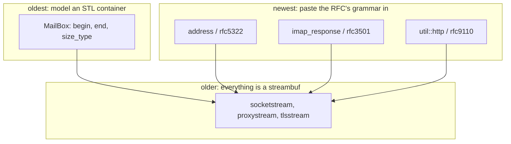

# The network code

The largest subsystem here — 17,600 lines — and the one where all three of
the library's organising habits are visible at once, layered by age.

A map. Every type named here is documented at its declaration, and where the
two disagree the header is right.

- `jlib/net/http.hh` — an HTTP client; `http_server.hh` has its own document
- `jlib/net/Imap4.hh`, `imap_response.hh`, `rfc3501.hh` — IMAP
- `jlib/net/Pop3.hh`, `net.hh` — POP3 and SMTP
- `jlib/net/address.hh`, `rfc5322.hh` — addresses
- `jlib/net/oauth.hh` — OAuth2 and XOAUTH2
- `jlib/net/MailBox.hh`, `MailFolder.hh`, `Email.hh` — the mailbox abstraction
- `docs/abnf.md` — the grammars; `docs/jhttpd.md` — the server

## Three habits, and you can date the code by which one it uses



**A mailbox is a container.** `MailBox` has `begin()`, `end()`, `iterator`,
`size_type`, `reference` — the whole STL vocabulary — because a mailbox is a
sequence of messages and the library's first habit was to say so in the
type system.

**A connection is a stream.** Every protocol client here talks over a
`sys::socketstream`, and TLS and a CONNECT proxy are the same thing with a
different buffer underneath. That is why an IMAP client works through a
proxy without knowing it does.

**A message is a grammar.** The newest code reads RFC ABNF pasted verbatim —
see `docs/abnf.md` — and this is where that habit pays most, because mail
formats are exactly where hand-rolled parsing fails.

## Addresses, and the mistake the grammar prevents

`address.hh` is the clearest case for the whole approach. A parsed address
gives you **a value and a source, and they are not the same string**:

```cpp
mailbox m = mailbox::parse("  joe . bloggs  @x.com (Joe)");

m.addr().local()   // "joe.bloggs"
m.addr().str()     // "joe.bloggs@x.com"
m.source()         // "  joe . bloggs  @x.com (Joe)"
```

The value is built from the productions that carry meaning; the source is
what was typed. **RFC 5322 puts `[CFWS]` inside `atom` and `dot-atom`**, so
the matched span of a local-part is full of the spaces and comments that are
not part of it. Taking `substr()` of the span — the obvious thing — is
wrong, and is most of what makes hand-rolled address parsing fail.

## IMAP, where ABNF runs out

`imap_response` reads RFC 3501's grammar, and IMAP is the protocol that
justifies `abnf`'s lower layer existing at all:

    literal = "{" number "}" CRLF *CHAR8
            ; Number represents the number of CHAR8s

The constraint is in a **comment** because ABNF cannot express it, so
`counted()` supplies it in combinators. See `docs/abnf.md`.

`resp-text-code` is enumerated rather than left opaque, which it was until
recently — and while it was, callers took values out of it with character
offsets. `Imap4` used `substr(7)` for `UNSEEN` and `substr(11)` for
`CAPABILITY`, two numbers that had to agree silently with two string
literals. The grammar reads them now (#371).

Ordering matters there in a way it does not in a CFG: `atom` matches every
code name, so it comes last. Move it first and every enumerated code
silently degrades to the fallback — no error, `code_number()` just returns
zero forever.

## The HTTP client is narrow, and says so to stay that way

What an OAuth2 token exchange needs and nothing else: GET, POST, a form
body, Content-Length and chunked responses, TLS, a CONNECT proxy. No
cookies, no keep-alive, no compression, no content negotiation, no HTTP/2,
no connection pool.

That list is in the header so it stays true. **The way a narrow thing
becomes a broad one is by nobody writing down that it was meant to be
narrow** — and there was no existing caller pulling it wider, because the
old `jlib::net::http` declared a `Request` and a `Response` that were never
defined anywhere.

**Reading a response lives in `jlib::util::http`, not here**, and that split
is structural rather than stylistic: `sys::basic_proxybuf` has to read the
answer to a CONNECT, and `jlib::sys` may not include `jlib::net`. So the
message layer sits below both.

## OAuth2, because mail now requires it

Gmail has wanted it since 2022 and Outlook.com has required it for personal
accounts since September 2024. A client speaking only LOGIN and AUTH PLAIN
cannot reach either.

`oauth.hh` has the refresh-token grant (RFC 6749 §6), XOAUTH2 to carry the
access token to an IMAP server, and the authorization-code flow with PKCE to
obtain the first refresh token — `authorize_url()`, `redirect_receiver`,
`exchange()`, and `authorize()` tying them together.

**One caveat that is not a bug and cannot be fixed here**: neither Google nor
Microsoft will issue a client id without the user registering an application
first. This can be complete and still not work for somebody who has not done
that.

## SMTP, and a transform a grammar would not improve

`net.cc` sends mail. Dot-stuffing — RFC 5321 §4.5.2 — is a character scan
rather than a production, correctly: it is a transport escape, not a
sentence in a language.

It carries a scar. The old version did nothing for a line like `.signature`
that is not a *lone* dot, which is the case the mechanism exists for: such a
line ended the DATA command early and fed the rest of the message to the
server as SMTP commands.

## Two generations, said out loud

The protocol layer is 51–65% comment and carries its reasoning: `http`,
`Imap4`, `imap_response`, `address`, `oauth`, `Pop3`, `net`.

The mailbox abstraction is not. `MailBox.hh` is 18%, `Email.hh` 37%, and
`MailFolder`, `MBox`, `MFolder`, `Imap4Box` and `Imap4Folder` are from 1999
with the conventions of the time. They work; they are undocumented, which is
a different thing and the larger risk. **This document is thinnest exactly
there**, and that is a statement about the code rather than about the
document.

`net_mbox_crlf_test` is what that risk looks like when it lands.
`MFolderBuffer::scan_headers` looked for `"\n\n"` to find where a message's
headers stopped -- and an mbox with CRLF line endings has `"\r\n\r\n"`
there and no `"\n\n"` anywhere, so the search always failed. The guard that
should have caught it was written against an `unsigned int`, which truncates
`npos` to `0xFFFFFFFF` and is therefore never equal to the real one, so the
guard could not fire. Two bugs, one of them a type, in code nobody had
reason to re-read.

The `AS*` files — `ASMailBox`, `ASImapBox`, `ASMBox` — are the asynchronous
variants, built on `sys::ASServent`. That is one of the four ways to wait
that `sys::reactor` was written to replace, and it is still what the mail
stack uses. So there are two async mechanisms in the tree: the reactor and
coroutines under HTTP (`docs/async.md`), and a condition variable under
mail.

## What it is not

No SMTP *server*, no IMAP server, no NNTP, no FTP. No mail queue or retry —
sending is synchronous and a failure is an exception.

No S/MIME or PGP in this layer; `jlib/crypt` exists and nothing here calls
it.

The mailbox abstraction is thinly tested: `net_mbox_crlf_test` and whatever
the IMAP and POP3 live tests reach through it.
