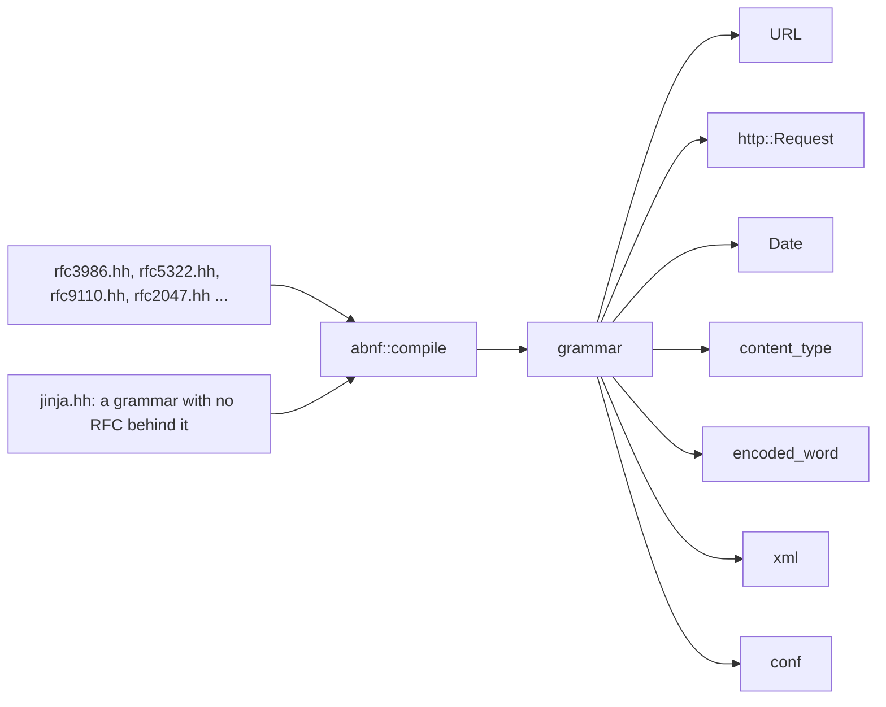

# Util

The layer between bytes and values. A socket hands you octets; something has
to turn them into a date, a media type, a URL, a header set, a tree — and
turn them back. That is all of this: 15,584 lines, second only to
`jlib/net` among the library modules.

A map. Every type named here is documented at its declaration, and where the
two disagree the header is right.

- `jlib/util/abnf.hh` — the parsing engine, documented in [abnf.md](abnf.md)
- `jlib/util/http.hh` — `Request`, `Response`, `fields`, chunked bodies
- `jlib/util/jinja.hh` — a Jinja2 subset, for chat templates
- `jlib/util/xml.hh`, `json.hh`, `conf.hh` — tree formats
- `jlib/util/Headers.hh`, `encoded_word.hh`, `content_type.hh`, `MimeType.hh`
- `jlib/util/Date.hh`, `URL.hh`, `utf8.hh`, `Regex.hh`
- `jlib/util/util.hh` — string surgery, base64, and `util::file`
- `jlib/util/rfc*.hh` — grammar text, pasted from the RFCs

## The organising fact

**Almost everything here reads a grammar rather than walking a string.**

Counting references to `abnf` against `find`/`substr` in each
implementation, the split is stark:

| | grammar | hand |
| --- | --- | --- |
| `jinja` | 60 | 9 |
| `conf` | 18 | 2 |
| `URL` | 13 | 9 |
| `http` | 12 | 7 |
| `Date` | 12 | 8 |
| `content_type` | 7 | 10 |
| `encoded_word` | 6 | 5 |
| `xml` | 5 | 3 |
| **`Headers`** | **0** | **20** |

`Headers` is the one component that never made the move. It is also the
best-tested thing here — five dedicated test files — which is the argument
for leaving it alone and the reason to be suspicious of that argument.

Three things parse nothing and belong to no column.

`json` is a facade over json-c, so the parsing is libjson-c's — the type
`json_object` is forward-declared in the header and never spelled out.

`MimeType` shells out to `file(1) --mime-type`, which "prints the answer
rather than a sentence about it, so nothing has to be parsed out", and
answers `application/octet-stream` when `file` cannot say. It is the one
thing here that depends on a program rather than a library.

`Regex` is a POSIX wrapper, and its header says plainly that jlib does not
use it: both callers it ever had were matching things with published
grammars, and both were wrong about them.

## jinja, and the grammar with nothing behind it

1,529 lines, and the exception that shows what the rule is worth.

Every other grammar here is pasted from a document, so a reader can check
the header against the RFC line by line. **Jinja has no published grammar.**
It is defined by its implementation, so `jinja.hh` was written from the
language reference and from the templates that actually have to work —
`jlib/ai/chat.cc` renders a model's chat template with it.

The header says so, in those terms, which is the honest version of a
dependency you cannot verify. It is a subset: enough to render a chat
template, not enough to run Jinja.

## conf, and writing the grammar before the feature

`conf` reads nginx-shaped configuration, and exists because jhttpd's flags
ran out of room — `--vhost NAME:ROOT:CERT:KEY` packs four fields into
colons, `--protect PREFIX:REALM:FILE` packs three, and the two split in
opposite directions because a path may contain a colon and a DNS name may
not.

The second reason is the more interesting one: jhttpd eventually wants to
read real nginx configuration, and writing the grammar now means that later
work is *implementing directives* rather than writing a parser. The
expensive half is done first, on purpose.

## Dates are three formats, not one

`Date` is 988 lines because mail and HTTP disagree and both are obliged to
read what the other sends: RFC 5322 with its obsolete forms, the HTTP
date, and ISO 8601 — plus a `date(1)`-style custom formatter with its own
directive set. It is half migrated: twelve grammar references against eight
hand-parse sites, which is the state of something converted where it was
worth converting.

## Headers, folding, and encoded-words

A header set is not a map of strings. A field can repeat, a value can fold
across lines, and anything non-ASCII arrives as an RFC 2047 encoded-word —
`=?UTF-8?Q?...?=` — which `encoded_word.hh` decodes and `Headers` calls
through `decode(value, charset)`.

`studly_caps` lives in `util.hh` and exists for this: field names go out
capitalised, `Content-Type` rather than `content-type`, because some
receivers still care.

## What `util.hh` is for now

The grab-bag, and it is smaller than it was. A 2.0 pass deleted
`Timer` (dead, and its `get_diff` borrowed by negating rather than adding
10^6, so a 0.2 s interval measured 0.8), the `java.util.Properties`-shaped
`load`/`store` pair, `excise`, `imaps` — which took a `const map&`, cast the
const away, and `operator[]`'d it, inserting into the caller's map — and the
camelCase half of `valueOf`/`string_value`, `intValue`/`int_value`,
`doubleValue`/`double_value`.

What remains is string surgery with no better home: `tokenize`, `trim`,
`slice`, the case-insensitive comparisons, `hex_value`, the `get<T>`/`set<T>`
pair that memcpy fixed-width fields in and out of a `std::string`, and
base64, base64url and quoted-printable.

And a `util::file` namespace that is not general at all. `size`, `mtime` and
`getstat` are what they sound like, but `kill` and `keep` take a vector of
byte offsets — even indices start a region, odd ones end it — and excise
those regions from a file in place, or everything but them. That is mbox
surgery: deleting a message from an mbox means cutting a byte range out of
the middle of it, and `net/MFolder.cc` and `net/ASMBox.cc` are the callers.
It reads as a general file utility and is nothing of the kind.

## Where the grammars live

`rfc3986.hh` (URI), `rfc5322.hh` (mail), `rfc9110.hh`/`rfc9112.hh` (HTTP
semantics and messaging), `rfc2045.hh`/`rfc2047.hh` (MIME and
encoded-words), and `jlib/net/rfc3501.hh` (IMAP) next door.

They are pasted, not transcribed, and every departure is marked `; jlib:`
with the reason — because the whole value of pasting is that a reader can
check one against the other. The departures are real and they are about
ordered choice: `rfc3986`'s `dec-octet` is reversed, because as published
the bare `DIGIT` alternative matches the `2` of `255` and wins.

That is a property of the engine, not of the grammar, and
[abnf.md](abnf.md) is where it is argued.

## One rule worth carrying out of here

Where a format has a published grammar, read the grammar. The two places in
the library that did not — `Email::get_received_ip` matching a dotted quad
with `([[:digit:]]{1,3}\.){3}[[:digit:]]{1,3}`, and gtkmail matching an
address with `[[:alnum:]]+@[[:alnum:].]+` — were both wrong, in the same
way, for years. The first accepted `999.999.999.999` and found addresses
inside timestamps; the second drops any domain with a hyphen in it.

`rfc3986.hh` had kept `IPv4address` in the grammar unreferenced, with a
comment saying it was there "so that a caller holding a host can ask whether
it is a dotted quad". The caller existed the whole time and was using a
regex.
